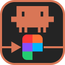
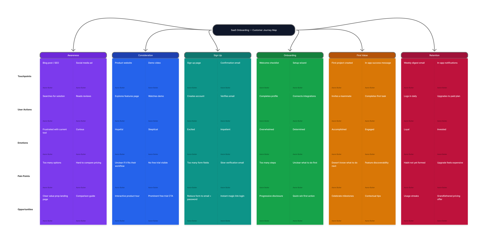
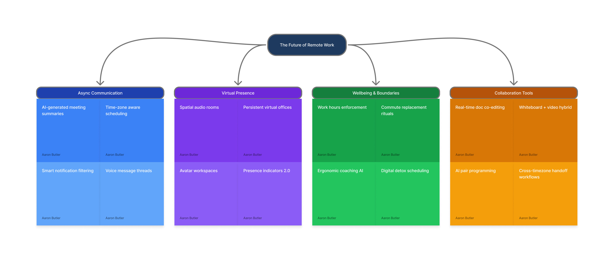
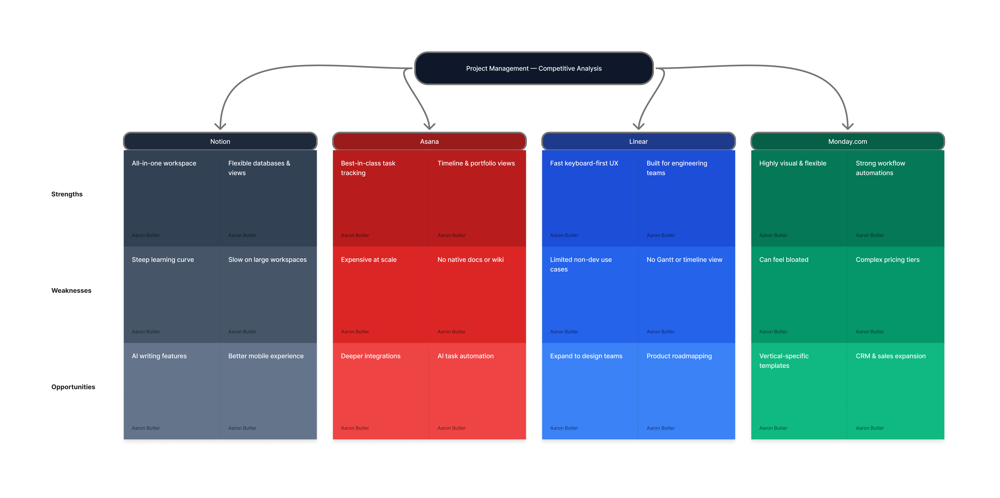
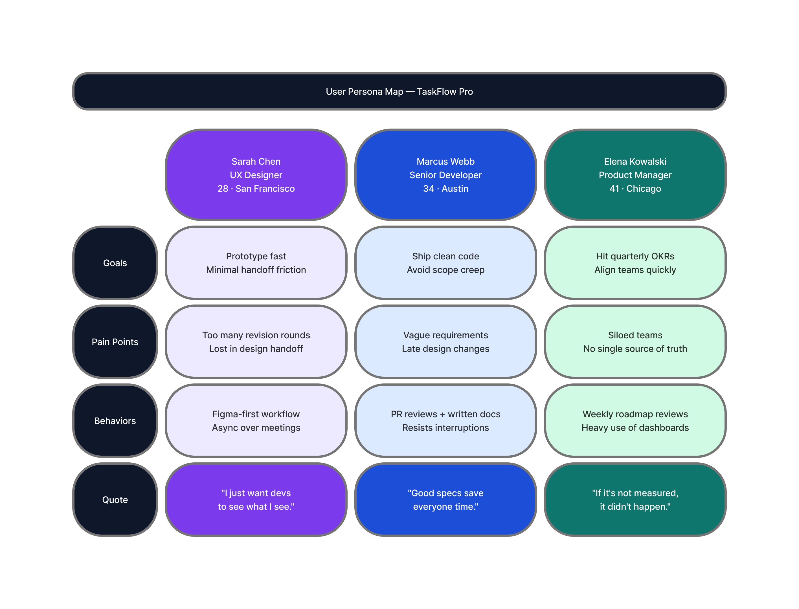
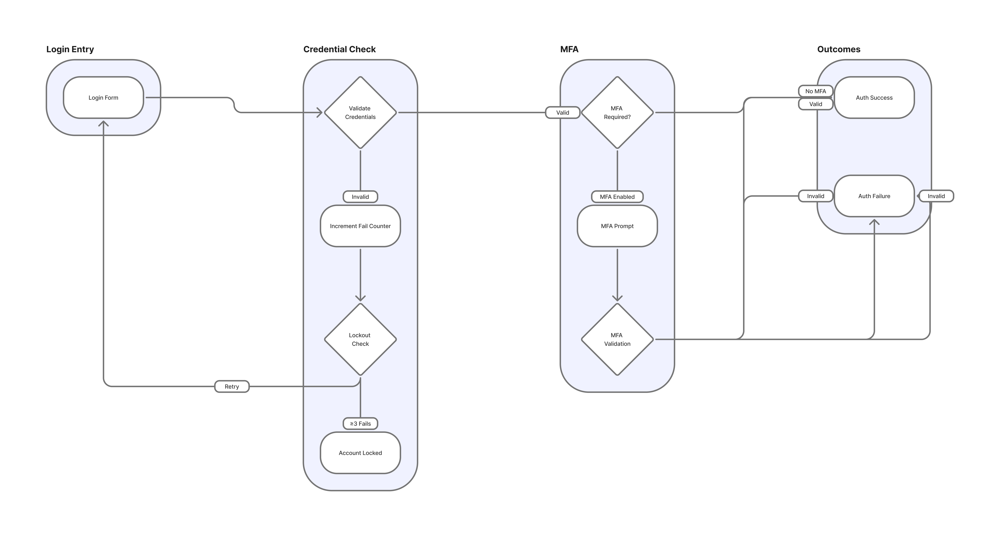

<p align="center">
  
</p>

# ClaudeJam

Work with your Claude Code agent directly inside FigJam. Think through ideas, map out flows, and build boards together in real time.

ClaudeJam is a FigJam plugin plus a small local server. Claude Code reads and writes the board you have open, so you can ask for a journey map, react to it, and keep shaping it together, all on the same canvas.



## What you'll need

- The **Figma desktop app** (FigJam plugins installed this way only run in the desktop app)
- **Claude Code**
- **Node.js**

## Install

**1. Get the plugin**

Download this repository (green **Code** button, then **Download ZIP**) and unzip it somewhere permanent, or clone it:

```
git clone https://github.com/ABCreativeDesign/ClaudeJam.git
```

**2. Add it to FigJam**

Open any FigJam file in the Figma desktop app, then go to **Plugins → Development → Import plugin from manifest…** and choose `manifest.json` from the folder you just downloaded.

**3. Connect Claude Code**

In a terminal, inside the project folder you use with Claude Code, run:

```
npx claudejam setup
```

This registers the ClaudeJam server with Claude Code for that project.

## Use it

1. Open a FigJam file and run **Plugins → Development → ClaudeJam**.
2. Open Claude Code in your project and send any message. The server starts on demand, and the plugin shows **Connected** within a few seconds.
3. Ask Claude to work on the board. For example: *"I need to map out our onboarding flow but I'm not sure where to start. Can you help me think through it on the open FigJam board?"*

## What it can build

Claude can create stickies, shapes, text, connectors, tables and code blocks, edit and arrange what's already there, and read the board back to check its work. It also knows tested layouts for common board types: brainstorms, competitive analyses, customer journey maps, kanban boards, mood boards, retrospectives, feature prioritization, timelines, and user persona maps.

| | |
|---|---|
|  |  |
|  |  |

## Good to know

- **One board at a time.** ClaudeJam works on the FigJam file the plugin is running in. To work on a different board, run the plugin there.
- **One Claude session at a time.** If two Claude sessions start the ClaudeJam server at once, only the first connects.
- **Claude desktop app (Cowork).** `npx claudejam setup` configures Claude Code. To use ClaudeJam from the Claude desktop app instead, add this to `claude_desktop_config.json` under `mcpServers` (on macOS or Linux, use `npx` instead of `npx.cmd`):

  ```json
  "claudejam": { "command": "npx.cmd", "args": ["claudejam", "--stdio"] }
  ```

## How it works

Claude Code talks to the ClaudeJam server over MCP. The server relays each command over a local WebSocket to the plugin, which makes the change on your canvas. Everything runs on your computer; nothing is sent anywhere else.

## Updating

Download the latest version and replace the plugin folder (or run `git pull` if you cloned it). FigJam picks up the new files the next time you run the plugin.

## License

[MIT](LICENSE) © 2026 ABCreativeDesign
